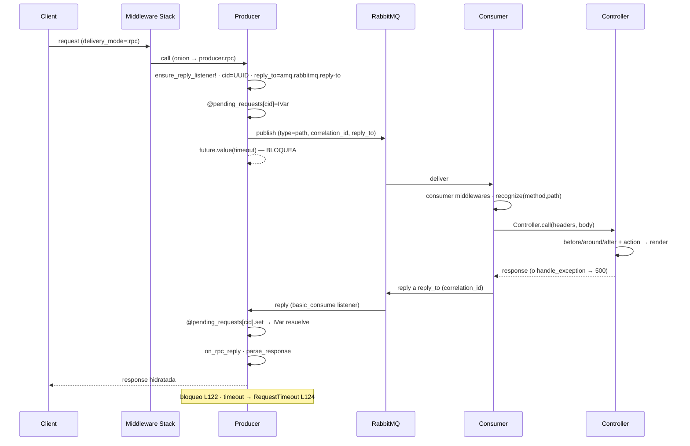
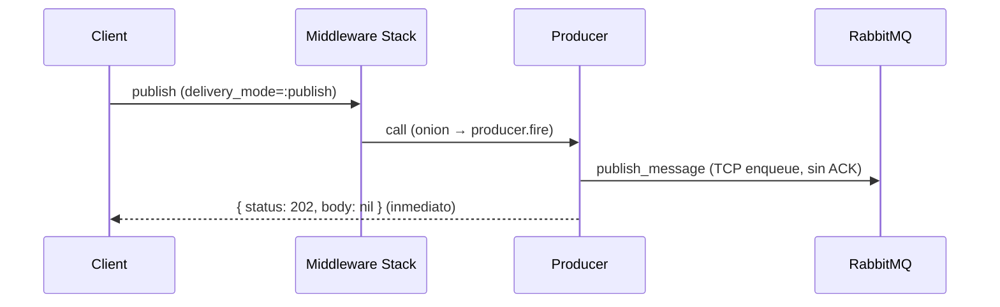
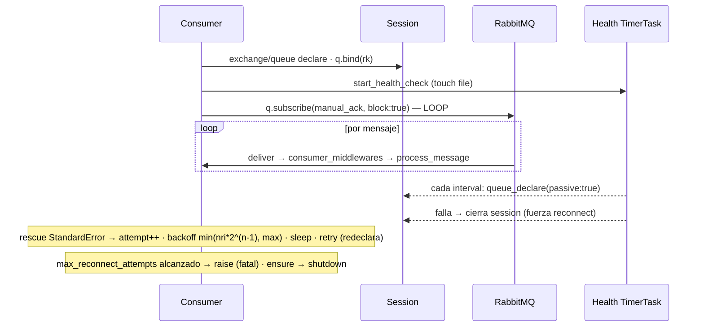
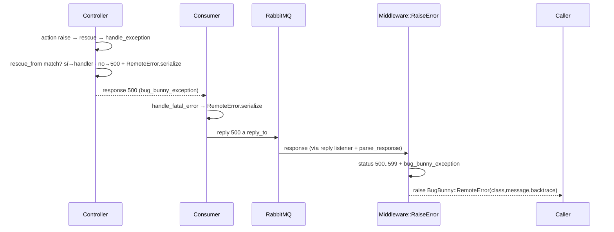
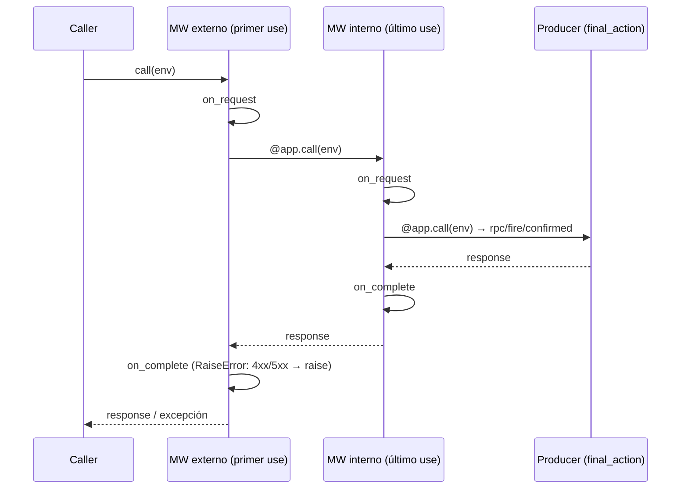

# Comportamiento — bug_bunny

> meta: artefacto `comportamiento` · RFC-007 (cadencia incremental default / completo on-demand) · generado dev-enrich 1.3.0 (backfill on-demand) · anclado a `a5cdb10` · cobertura: completa (6 flujos) — backfill solicitado explícitamente

## 1. Resumen

Flujos de ejecución de la gema. Generado en **modo completo on-demand** (RFC-007 §2 / dev-enrich 1.3.0): backfill solicitado explícitamente, no incremental. Invariante de honestidad (RFC-001 §3.3): anclado a código real (`file:line`), lógica dispersa marcada como tal, cobertura declarada, **verificación humana pendiente** (el LLM extrajo las secuencias; el humano confirma contra el código).

## Cobertura (OBLIGATORIO)

| Flujo | Estado | Anclaje principal |
|---|---|---|
| RPC síncrono | **documentado** | `producer.rb:103-134`, `consumer.rb:152-293` |
| Fire-and-forget | **documentado** | `producer.rb:47-51,146-161` |
| Confirmed + basic.return bridge | **documentado** | `producer.rb:72-93,299-333`, `session.rb:204-250` |
| Consumer subscribe loop + reconnect + health | **documentado** | `consumer.rb:66-127,340-361` |
| Error handling / RemoteError | **documentado** | `consumer.rb:320-329`, `remote_error.rb`, `raise_error.rb:32-65` |
| Client middleware stack (onion) | **documentado** | `middleware/stack.rb:43-47`, `base.rb:35-43` |

Cobertura completa a `a5cdb10`. Acreta incremental en cada PR que toque un flujo (default RFC-007). Ausencia futura ≠ inexistencia.

## 2. Cuerpo

### Flujo: RPC síncrono
Request-response bloqueante; el hilo emisor espera en `Concurrent::IVar` correlacionado por `correlation_id` hasta reply o `RequestTimeout`.


Contexto: `client.rb:97-101` → `producer.rb:103-134` (bloqueo L122) → reply listener `producer.rb:405-424` → `consumer.rb:247,272-293`.

### Flujo: Fire-and-forget
Publica y retorna `{ 'status' => 202 }` sin esperar broker ni consumer.


Contexto: `client.rb:129-134` → `producer.rb:47-51` → `publish_message producer.rb:146-161`.

### Flujo: Confirmed + basic.return bridge
ACK del broker síncrono; `basic.return` (mandatory unroutable) llega en el reader thread de Bunny y se puentea al hilo de publish vía `@pending_returns` + `Concurrent::Event` con ventana de tolerancia GVL.

```mermaid
sequenceDiagram
    participant CL as Client
    participant P as Producer
    participant S as Session
    participant BR as RabbitMQ
    participant RT as Bunny reader thread
    CL->>P: publish confirmed:true [mandatory]
    P->>S: register_return_listener(cid) → Event+slot
    P->>BR: publish_message (mandatory)
    P-->>P: wait_for_confirms! — BLOQUEA (IVar si hay timeout)
    BR-->>RT: basic.return (si unroutable)
    RT->>S: handle_broker_return → signal_return_listener
    S->>S: slot[:info]=info · slot[:event].set
    BR-->>P: confirms (ack/nack)
    P->>P: handle_confirm_result — nack → PublishNacked
    P->>P: handle_return_result → event.wait(RETURN_RACE_WINDOW_S=0.05s)
    P->>P: slot[:info] presente → raise_unroutable!
    P-->>CL: PublishUnroutable (o éxito si slot vacío)
    Note over RT,S: on_return user callback corre antes del raise; su excepción se loggea, no propaga
```
Contexto: `producer.rb:72-93,200-216,281-345`; `session.rb:70-74,204-250`. Branches: ack→ok · nack→`PublishNacked` (`producer.rb:235`) · return→`PublishUnroutable` (`producer.rb:325`) · timeout→`RequestTimeout` (`producer.rb:214-215`).

### Flujo: Consumer subscribe loop + reconnect + health
Loop bloqueante infinito con backoff exponencial + jitter en error; health check en TimerTask separado, **acoplado flojo** vía estado de session.


Contexto: `consumer.rb:66-127` (retry L106-124), `consumer.rb:340-361` (health). **Honestidad:** health check es thread aparte (TimerTask); no es parte del manejo de error del loop — se acoplan sólo vía cierre de session. Marcado, no fingido como un único flujo.

### Flujo: Error handling / RemoteError
Excepción no manejada en controller → serializada (clase/mensaje/backtrace[0..25]) → reply 500 → reconstruida client-side por `Middleware::RaiseError`.


Contexto: `controller.rb:200-234`, `consumer.rb:320-329`, `remote_error.rb:29-48`, `raise_error.rb:32-65`. **Honestidad:** backtrace truncado a 25 líneas en serialize; si el controller nunca llega a responder, el cliente expira por timeout en vez de recibir el error (no hay path de error garantizado).

### Flujo: Client middleware stack (onion)
`Stack#build` hace `@middlewares.reverse.inject(final_action)` → el **primer `use` queda como el más externo** (corre `on_request` primero, `on_complete` último). Documentado en `stack.rb:37-39`; sigue la convención Rack/Faraday (primer registrado = capa externa).


Contexto: `middleware/stack.rb:31-47` (build L43-47, `reverse.inject`), `base.rb:35-43` (`call`: on_request → @app.call → on_complete), `client.rb:160-163` (final_action + `@stack.build(final_action).call(req)`). Orden: `use A; use B` → **A más externo** (corre primero), B envuelve al producer. `RaiseError` solo define `on_complete` (sin `on_request`).

## 3. Inferencias

| Inferencia | confidence | a verificar (humano) |
|---|---|---|
| Secuencias y `file:line` extraídos por el LLM del código a `a5cdb10`; re-verificados en una 2ª pasada LLM contra el código (corregidas 3 discrepancias: flujo middleware invertido, timeout RPC `producer.rb:124`, timeout confirmed `producer.rb:214-215`) | inferred | confirmación **humana** final pendiente (invariante RFC-001 §3.3) |
| Orden wire `basic.return → basic.ack` garantizado por AMQP; `RETURN_RACE_WINDOW_S` cubre GVL | declared (código) / inferred (garantía AMQP) | confirmar lectura de `producer.rb:299-308` + spec AMQP |
| Health check acoplado flojo al loop vía cierre de session | inferred | confirmar `consumer.rb:340-361` vs `106-124` |

## 4. Cobertura y fronteras

- **Modo:** completo on-demand (RFC-007 §2). Default futuro = incremental por PR; este artefacto se actualiza en el mismo PR que toque cualquier flujo.
- **Lógica dispersa marcada (no fingida):** health check (thread aparte vía `Concurrent::TimerTask`, acople flojo con el loop sólo vía cierre de session). RFC-007: marcada, no diagramada como flujo limpio falso. (El orden onion del middleware NO es lógica dispersa: es mecanismo limpio y documentado en `stack.rb:37-39`.)
- **Fuera de alcance:** estructura (operaciones/interfaz/topología) → dev-structure F2 (no implementado). Significado de términos → `glossary.md`. Datos → n/a (sin DB).
- **Frescura:** PR que renombre/mueva un método citado → reviewer actualiza el diagrama y `file:line` en el mismo PR (RFC-001 §3.3).
- **Verificación humana pendiente:** obligatoria antes de considerar este artefacto confiable.
